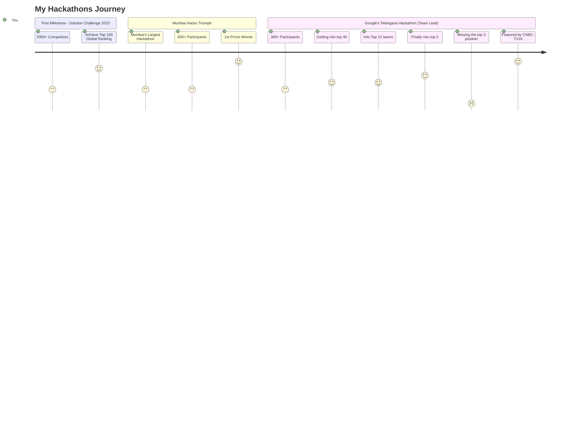
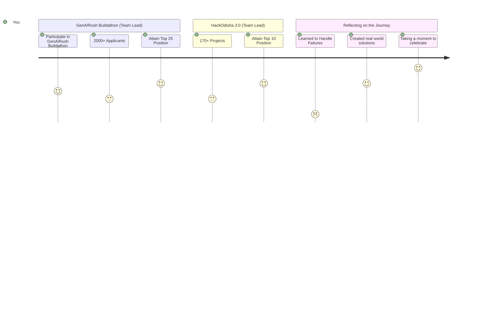

<h1 align="center">Hi  I'm Kailash Sharma</h1>
<h2> A dynamic Modern Android Developer, Builder and a Poet! </h2> 
<h3 align="left">

-  I’m currently learning **App Developement**

- 🎯 Wants to Implement **CI/CD for Android**

- ⚡ Fun fact **Apart from a developer, also a poet by a ❤️**

- 🤝 I’m looking for help with **Android & iOS Developement**

- 👨‍💻 All of my projects are available at [github.com/thekaailashsharma](github.com/thekaailashsharma)

- 💬 Believes **Projects are only way to learn.**

- 📫 Contact me **kailashps.1011@gmail.com**

- 📄 Know about my experiences [linkedin.com/in/thekaailashsharma](linkedin.com/in/thekaailashsharma)

- 😎 Find me anywhere, just search **thekaailashsharma**
</h3>
<h2> Together, let's can shape the future of technology  </h2> 

<h3 align="left">Connect with me:</h3>

<h3 align="left">Languages and Tools:</h3>

                   

<a href="https://g.dev/thekaailashsharma/"><!-- wi*quL3fcV --></a>

 
 

 
  

<h3 align="left">Support:</h3>

  

